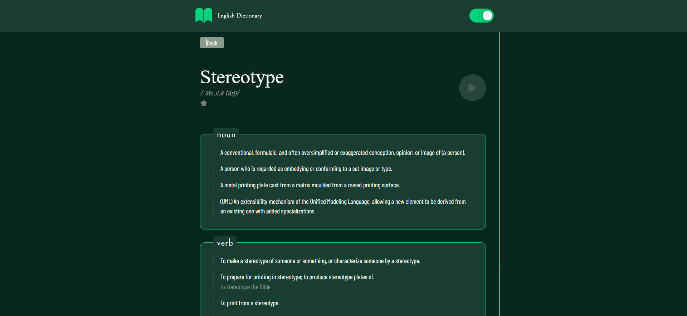
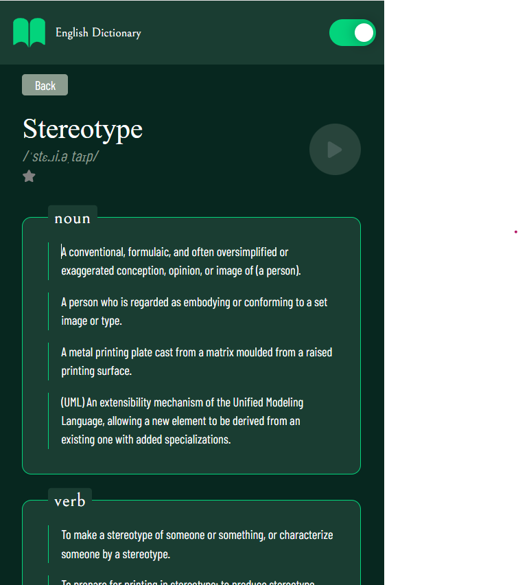

# Voice Dictionary Search

A web application that allows users to search for words using their voice. The app fetches word definitions from a dictionary API and displays the results.

##Live Site 

-[Live Site Here](https://voice-dictionary-search.vercel.app/)

### Screenshots

#### 📸 Desktop



#### 📸 Mobile 



## Features

- ✅ Voice-based search for words  
- ✅ Fetches word definitions from an API  
- ✅ Next.js App Router for optimized routing  
- ✅ Server Actions for improved data handling  
- ✅ Error handling with dedicated error components  

## Tech Stack

- **Frontend:** React, Next.js, Tailwind CSS  
- **Backend:** Next.js Server Actions  
- **API:** Dictionary API  
- **State Management:** useState, useEffect  
- **Deployment:** Vercel 

## Installation & Setup

### Clone the repository:

```sh
git clone https://github.com/qobonyoni/voice-dictionary-search.git
cd voice-dictionary
```

### Install dependencies:

```sh
npm install  # or yarn install
```


### Run the development server:

```sh
npm run dev  # or yarn dev
```

Open [http://localhost:3000](http://localhost:3000) in your browser.

## Usage

1. Click the microphone button to start voice input or type in the search word and click enter.
2. The app will process your speech, fetch the definition, and display it.


## Challenges & Lessons Learned

### Routing in Next.js
As someone new to the Next.js App Router, getting used to the new file structure took some time, but it has been a smooth experience so far.

### Error Handling
With Next.js, it is easier to define error boundaries and handle unexpected failures.

### `'use client'` vs. `'use server'`
I initially struggled with this concept, but I learned that any component requiring event listeners should use `'use client'`.

## Future Improvements

- Implement caching for faster searches  
- Add suggestions for misspelled words  
- Improve UI/UX with better animations  

## Contributing

Feel free to submit issues and pull requests.

